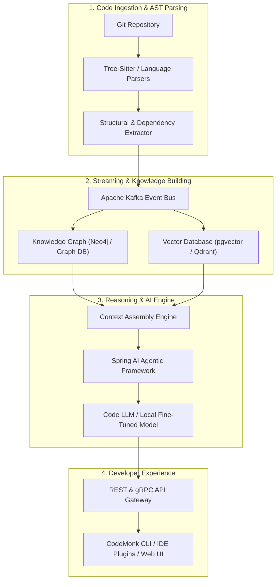

# 🥋 CodeMonk

> An open-source AI-powered platform for understanding complex codebases.

Navigating a massive codebase shouldn't feel like wandering through an ancient maze without a map. CodeMonk is an open-source engineering initiative built to transform how developers discover, understand, and reason about complex, multi-service software systems. Instead of treating code as flat text files, CodeMonk builds structural knowledge graph representations and intelligent retrieval pipelines to bring deep architectural comprehension directly to developers.

---

## 💡 Why Does This Exist?

You clone a new repository on your first day. 

Or maybe you are tasked with adding a feature to a legacy monolith that your team inherited.

* **Thousands of files** across dozens of packages.
* **Hundreds of classes** deeply coupled through inheritance, interfaces, and dynamic dependency injection.
* **Multiple microservices** communicating asynchronously over message buses and RPCs.
* **Outdated documentation**—or worse, none at all.

You start grepping through the codebase. You jump from file to file following references. You open five different tabs of outdated Wiki pages. You ping senior engineers on Slack, waiting hours for a quick hint on how a single data pipeline flows. Before you write a single line of working code, you've spent days just trying to answer: *"Where does this request actually go?"*

CodeMonk is being built to eliminate this friction. We believe software architecture should explain itself, dynamically and accurately, powered by deep structural analysis and modern AI.

---

## 🎯 What Are We Building?

CodeMonk bridges raw code parsing with state-of-the-art AI reasoning. Rather than relying solely on naive keyword matching or plain vector embeddings of code snippets, CodeMonk extracts the underlying relationships—call graphs, data flows, cross-service contracts, and schema boundaries—into a unified context engine.

```
Repository
   ↓
Understand the Code (AST & Structural Parsing)
   ↓
Build Knowledge (Knowledge Graph & Vector Embeddings)
   ↓
Retrieve Context (Hybrid RAG & Relationship Traversal)
   ↓
Reason with AI (Spring AI & Multi-Agent Orchestration)
   ↓
Help the Developer (Instant Architectural Insights)
```

By connecting static code analysis with graph representations and large language models, CodeMonk allows developers to query their software system at an architectural level.

---

## ⚡ Why Is This Interesting?

CodeMonk is a real-world playground for modern distributed systems, code intelligence, and practical AI engineering. If you are passionate about high-performance backends or cutting-edge AI techniques, this project brings together complementary domains:

| Technology Domain | Engineering Application in CodeMonk |
| :--- | :--- |
| **☕ Spring Boot 3 & Java 21** | Building resilient, modular enterprise services leveraging virtual threads and modern Java capabilities. |
| **🌐 Spring Cloud** | Service discovery, distributed configuration, and API gateway routing for multi-service environments. |
| **📨 Apache Kafka** | High-throughput event streaming for real-time code change events, asynchronous indexing, and pipeline tasks. |
| **🌲 Code Analysis & AST Parsing** | Parsing Java, Kotlin, TypeScript, and Go into Abstract Syntax Trees to extract call graphs, definitions, and references. |
| **🕸️ Knowledge Graphs (Neo4j)** | Modeling class hierarchies, API endpoints, database schemas, and microservice dependencies into graph structures. |
| **🔎 Vector Search & Hybrid RAG** | Vector databases (pgvector / Qdrant) combined with lexical search for semantic code snippet retrieval. |
| **🧠 Spring AI & AI Agents** | Multi-agent reasoning chains, tool orchestration, and LLM provider integration native to the Spring ecosystem. |
| **🔬 Model Evaluation & Fine-Tuning** | Benchmark suites for code retrieval accuracy, PEFT / LoRA adaptation of open-weights LLMs for specialized code tasks. |

Every technology in CodeMonk serves a clear architectural purpose. As a contributor, you get hands-on experience building production-grade distributed AI infrastructure.

---

## 🔮 The Big Idea

Imagine opening your terminal or IDE and asking CodeMonk questions that previously required hours of code diving:

> 🗣️ **"How does user authentication work across services in this repository?"**
>
> 🗣️ **"Where does an incoming `/orders/checkout` request go after hitting the API gateway?"**
>
> 🗣️ **"What downstream services and message queues consume events published by `PaymentProcessedEvent`?"**
>
> 🗣️ **"If I change the signature of `UserService.updateProfile()`, what components might be affected?"**
>
> 🗣️ **"Explain this project's architecture to someone who has never seen it before."**

These are our core engineering goals. We are building the foundational pipelines to make this level of repository intelligence a reality.

---

## 🏗️ Architecture

CodeMonk is designed with a decoupled, event-driven architecture to process repositories at scale:



---

## 📌 Current Status

We are committed to full transparency about what exists today versus what is being actively engineered.

| Component | Status | Details |
| :--- | :---: | :--- |
| **Core Architecture & Service Skeleton** | ✅ Available | Spring Boot 3 base setup, project structure, and local dev environments. |
| **Basic Code Tokenization & Storage** | ✅ Available | Repository file ingestion and basic metadata extraction. |
| **AST Code Parsing & Relation Extraction** | 🚧 In Progress | Tree-Sitter integration for Java structural parsing and dependency extraction. |
| **Apache Kafka Pipeline** | 🚧 In Progress | Async event bus for repo indexing events and job queuing. |
| **Vector Indexing & Hybrid Retrieval** | 🚧 In Progress | Embedding pipeline setup with pgvector integration. |
| **Knowledge Graph Schema Design** | 🔮 Planned | Graph model specification for cross-service call trees and data models. |
| **Spring AI Agent Orchestration** | 🔮 Planned | Multi-step agent tools for repository-level contextual Q&A. |
| **Impact Analysis Engine** | 🔮 Planned | Graph-based change detection and dependency blast radius calculation. |
| **Fine-Tuning & Evaluation Suite** | 🔮 Planned | Benchmarking framework for code understanding accuracy. |

---

## 🚀 Quickstart for Local Development

Start the infrastructure containers and build the microservices ecosystem:

```bash
# 1. Start local infrastructure (PostgreSQL with pgvector, Redis, Kafka)
docker compose up -d

# 2. Build & run tests across all microservices
./mvnw clean test
```

---

## 🗺️ Roadmap

Building CodeMonk is a step-by-step journey. Here is our strategic roadmap:

```
🥋 Phase 1 — Foundation
   ├── Core service architecture setup
   └── Local development Docker environment

🗺️ Phase 2 — Repository Understanding
   ├── Multi-language AST parsing (Java/Kotlin/TS)
   └── Call graph & dependency structure extraction

🧠 Phase 3 — Code Intelligence
   ├── Apache Kafka event pipeline for async indexing
   └── Incremental repository diff tracking

🔎 Phase 4 — Retrieval & RAG
   ├── Code chunking & hybrid vector embedding
   └── Semantic code search engine

🕸️ Phase 5 — Knowledge Graph
   ├── Graph database integration (Neo4j)
   └── Microservice & database schema relationship mapping

🤖 Phase 6 — AI Intelligence
   ├── Spring AI agentic framework & tool definitions
   └── Contextual Q&A over full repositories

⚡ Phase 7 — Impact Analysis
   ├── Blast-radius visualization for refactoring
   └── Pull Request automated architecture review

🔬 Phase 8 — AI Research
   ├── Custom code evaluation benchmarks
   └── Fine-tuning lightweight open models (PEFT / LoRA)
```

---

## 🤝 Contribute

**You do NOT need to be an AI researcher.**  
**You do NOT need to be a senior architect.**  
**You do NOT need to understand every file in this repository.**

Whether you are fixing a small bug, writing unit tests, improving documentation, or designing a graph schema, your contribution is valuable. CodeMonk is built by developers, for developers.

### Choose Your Path

Find a module that aligns with your interests and skills:

* 🥋 **Backend Engineering**: Java 21, microservices architecture, clean code principles.
* ☕ **Spring Boot**: REST APIs, application configuration, Spring security, and actuators.
* 🌐 **Spring Cloud**: Gateway, service discovery, resilient communication patterns.
* 📨 **Apache Kafka**: Streaming pipelines, event producers/consumers, topics partition management.
* 🧠 **Spring AI**: Building agents, memory managers, and prompt engineering pipelines.
* 🔎 **RAG & Search**: Chunking strategies, vector embeddings, hybrid search algorithms.
* 🕸️ **Knowledge Graphs**: Cypher queries, graph schemas, relationship modeling in Neo4j.
* 🔬 **AI / ML**: Evaluation metrics, fine-tuning scripts, model optimization.
* 🧪 **Testing**: Unit tests, integration tests, Testcontainers, mock services.
* 🐳 **DevOps & Infra**: Docker, Kubernetes manifests, CI/CD GitHub Actions pipelines.
* 📚 **Documentation**: Architecture guides, setup tutorials, code inline docs.
* 🎨 **Developer Experience**: CLI design, web interface UI, IDE extensions.

---

## 🌱 Good First Contribution

Never contributed to CodeMonk before? Here is how to get started in 8 simple steps:

1. **Fork the Repository**: Click the **Fork** button at the top right of this GitHub page.
2. **Clone & Explore**: Clone your fork locally and inspect the project structure.
3. **Check the Architecture**: Read through our [Architecture](#-architecture) section above.
4. **Pick an Issue**: Browse open issues on GitHub tagged with newcomer-friendly labels:
   * `good first issue` — Great starter tasks requiring minimal setup.
   * `beginner` — Low-complexity tasks ideal for first-time contributors.
   * `intermediate` — Tasks focused on specific service features.
   * `advanced` — Complex subsystem design or AI pipeline work.
   * `help wanted` — Tasks where community feedback and contributions are actively sought.
5. **Ask Questions**: Unsure about something? Comment directly on the issue! We love answering questions and helping contributors get unblocked.
6. **Create a Branch**: Create a feature branch (`git checkout -b feature/my-cool-fix`).
7. **Make Changes & Test**: Write clean code, add tests, and verify locally using `./gradlew test` (or `./mvnw test`).
8. **Open a Pull Request**: Submit your PR with a brief summary of what you built.

---

## 🪜 Contributor Journey

We believe open source should empower your technical growth. As you contribute to CodeMonk, you can naturally evolve your role within the community:

```
First PR (Fix a typo, add a test, or resolve a good first issue)
   ↓
More Contributions (Implement a feature module or AST parser)
   ↓
Feature Ownership (Take ownership of a component like Kafka indexing or RAG search)
   ↓
Maintainer / Architect (Review PRs, mentor new contributors, and guide project vision)
```

---

## 💎 Why Contribute?

CodeMonk isn't just another side project—it's a real-world software engineering ecosystem. By contributing, you will:

* 🛠️ **Work on a real distributed system**: Build event-driven microservices handling non-trivial data pipelines.
* 🚀 **Master modern Spring**: Gain hands-on experience with Spring Boot 3, Spring Cloud, and Spring AI.
* 🧠 **Experiment with production AI**: Work beyond simple API calls by building hybrid RAG engines, agentic tool workflows, and graph-augmented contexts.
* 👥 **Collaborate with peers**: Code alongside passionate developers, receive constructive code reviews, and share knowledge.
* 📐 **Understand system design**: Learn how real enterprise software is structured, tested, and deployed.
* 📜 **Build a public track record**: Demonstrate real open-source achievements on your GitHub profile.

---

## 💬 Community

CodeMonk is not meant to be built by one person or a closed team. 

The architecture, features, documentation, experiments, and roadmap ideas are all open to being shaped by contributors like you. Have an idea for a new feature? Want to propose an alternative graph schema? Found a performance bottleneck?

* 💡 **Propose an Idea**: Open a GitHub Discussion to brainstorm new concepts.
* 🐛 **Report a Bug**: File a detailed GitHub Issue if something breaks.
* 💬 **Join the Conversation**: Engage with fellow developers in issue threads and PR reviews.

---

## 👥 Contributors

CodeMonk is built by developers from around the world. Every single contribution matters—from fixing a typo in the README to designing a major subsystem.

<a href="https://github.com/YeamimHossainSajid/CodeMonk/graphs/contributors">
  
</a>

*Thank you to everyone who has dedicated their time and talent to building CodeMonk!*

---

## 🚀 Join Us in Building CodeMonk

Found something interesting?  
Have an idea to share?  
Want to build a piece of the future of code intelligence?

**Pick an issue. Start a discussion. Open a pull request.**

### **Join us in building CodeMonk. 🥋**
